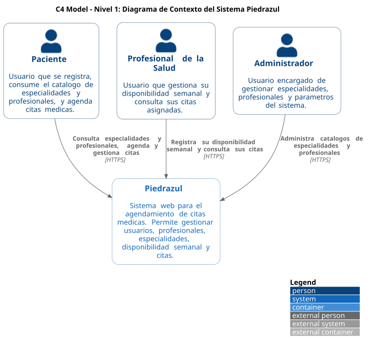
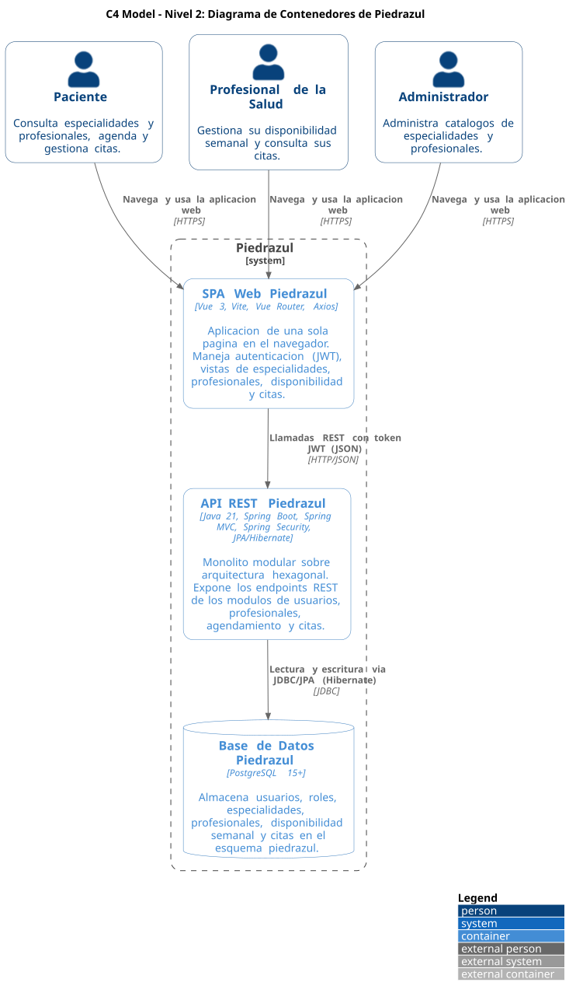
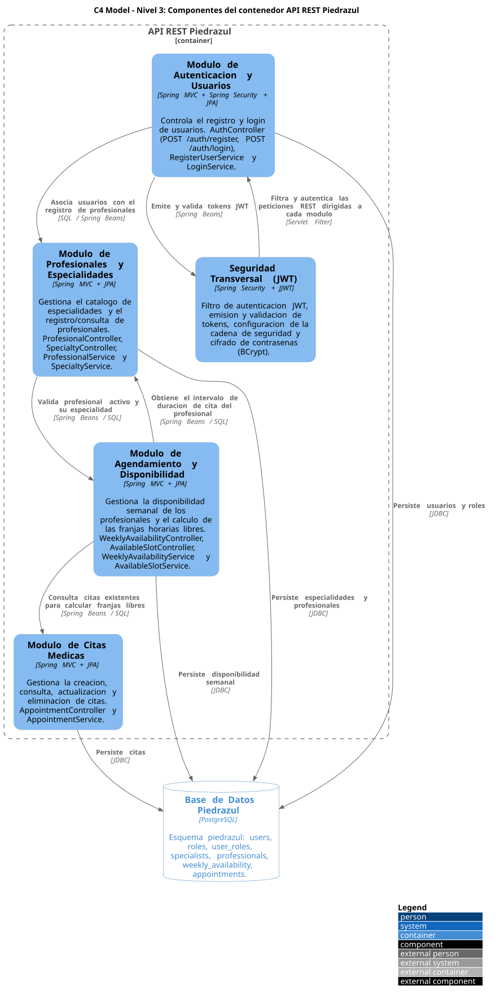
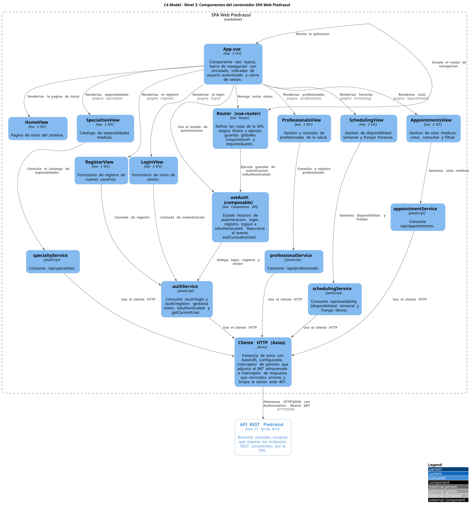
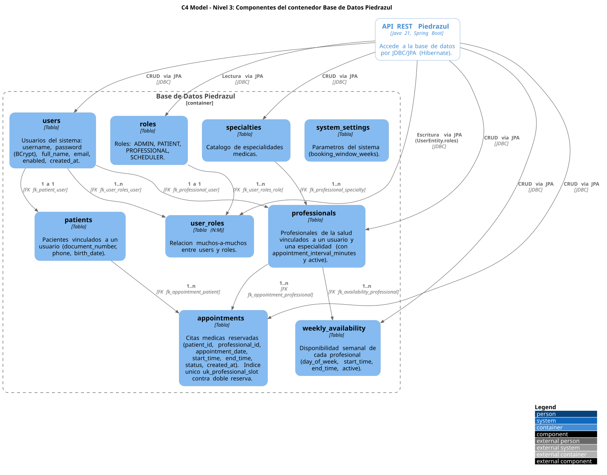
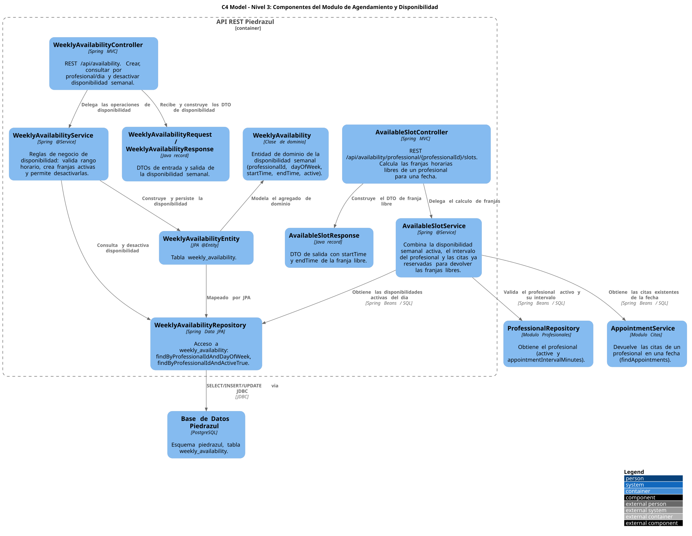
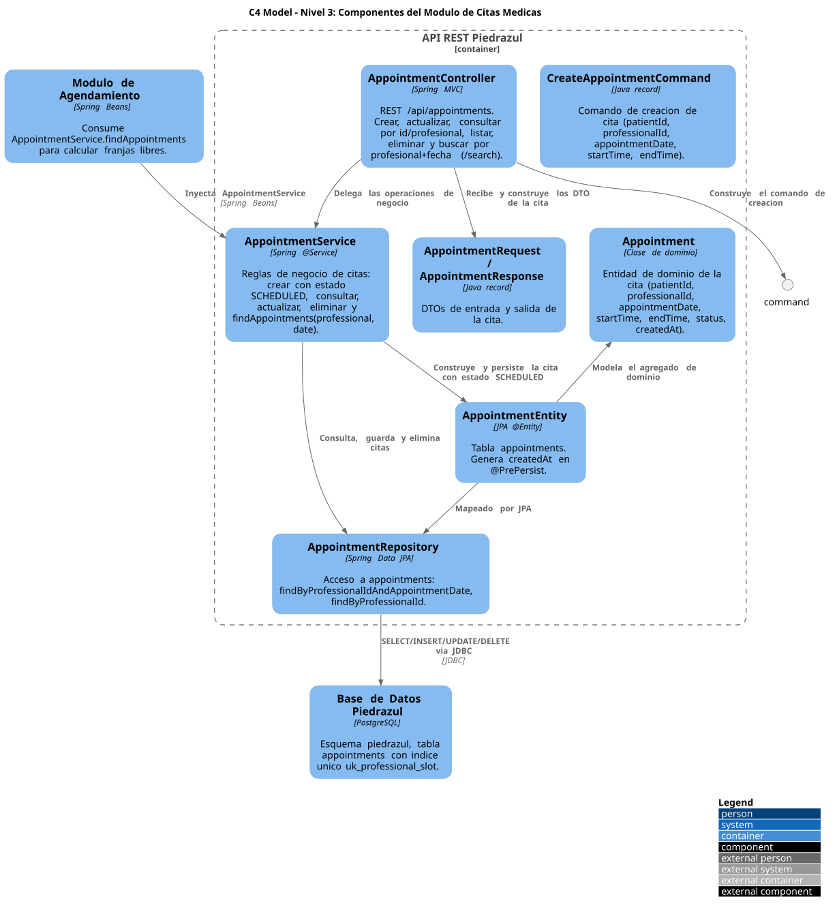
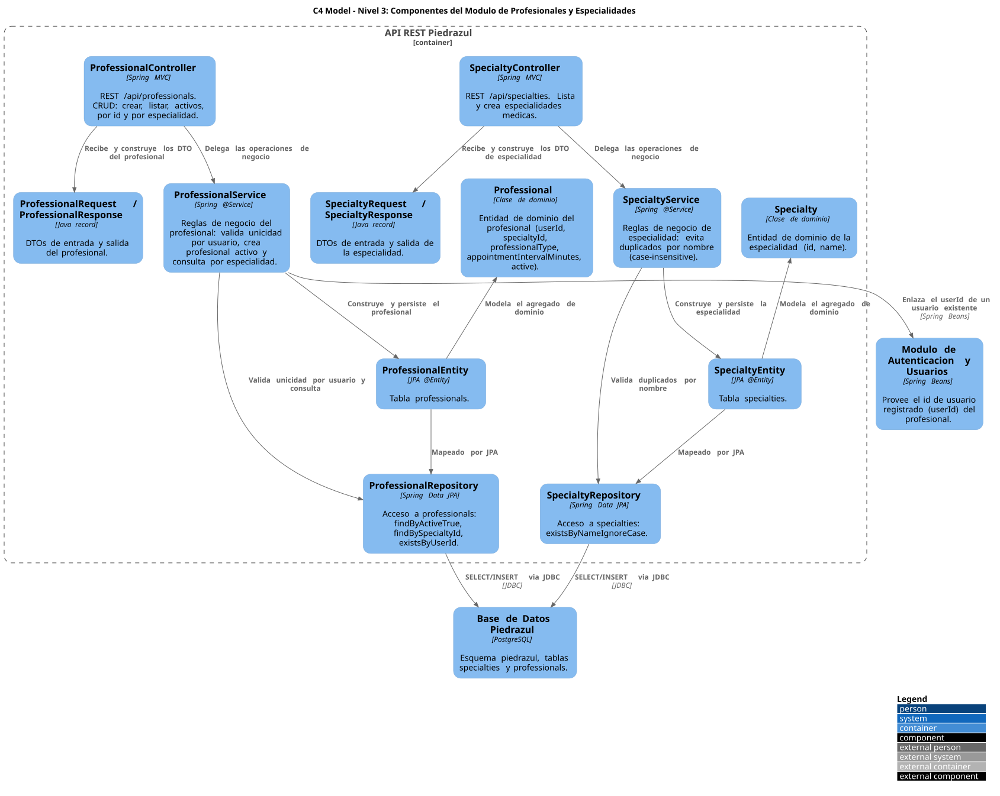
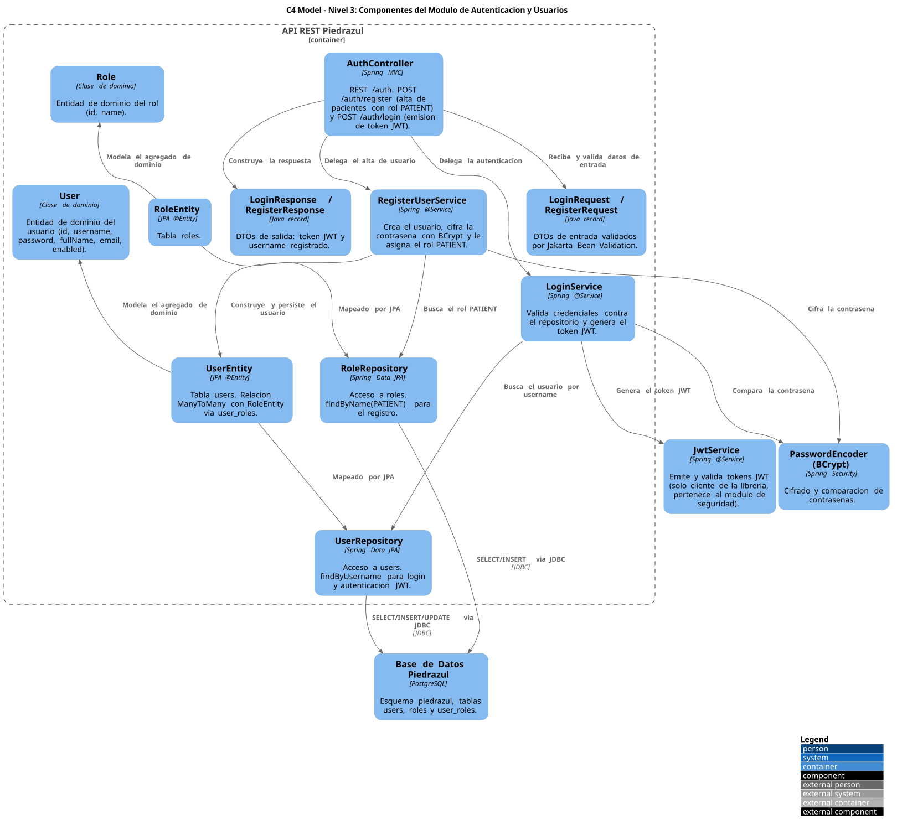
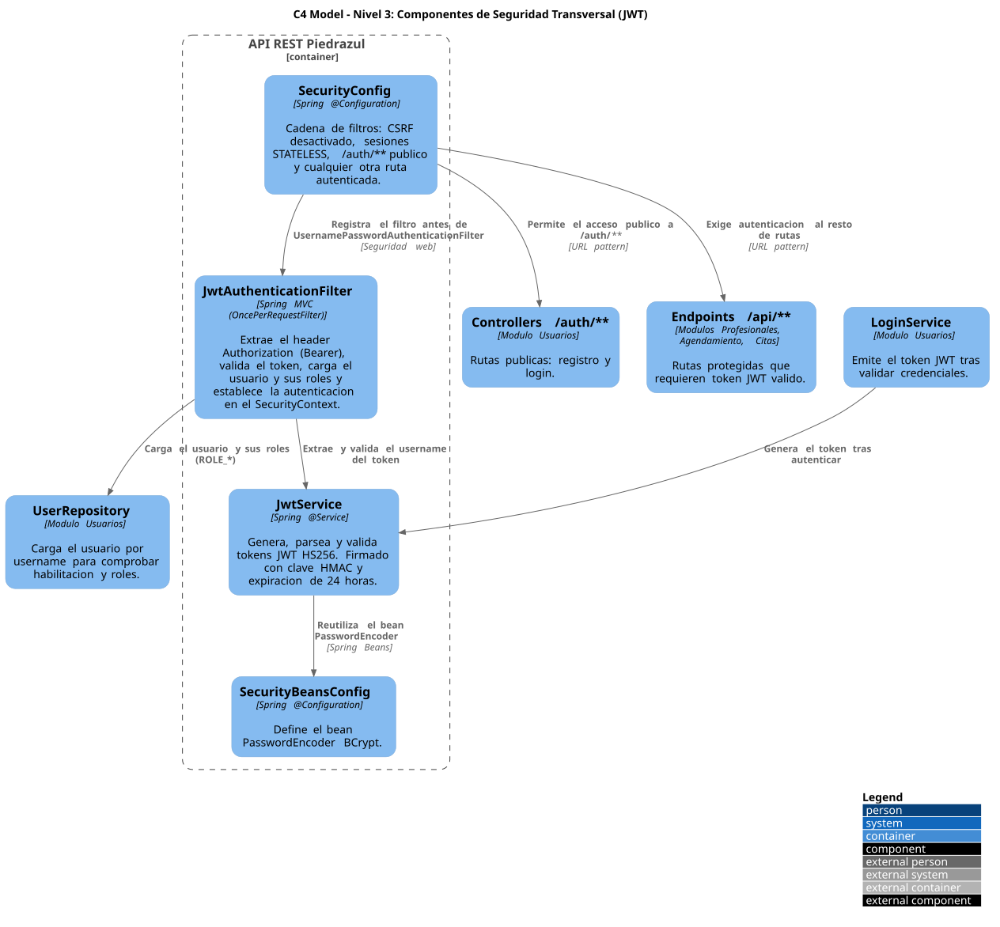

# Modelo C4 - Piedrazul Monolito Modular

Documentacion de arquitectura usando el modelo C4.

## 1. Contexto del Sistema

## 2. Contenedores

## 3. Componentes
### Backend

### Frontend

### Base de Datos

### Modulo Agendamiento

### Modulo Citas

### Modulo Profesionales

### Modulo Usuarios

### Seguridad

